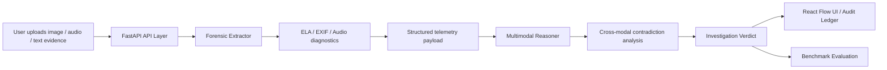

# TrustLayer: Multi-Modal Authenticity Engine

TrustLayer is a multi-modal forensic analysis engine built for the GDG Hackathon blueprint. The core idea is simple: do not evaluate media in isolation. Instead, treat images, audio, and text as a single evidence bundle, compare their signals and contradictions, and produce a calibrated verdict with explicit uncertainty.

The project is designed around a 4-part engineering split:

- Workstream 1: media forensics and signal extraction
- Workstream 2: multimodal reasoning and AI verdict synthesis
- Workstream 3: FastAPI integration and benchmarking
- Workstream 4: frontend / UX and graph visualisation

This repository focuses on the backend and reasoning layers that connect the forensic signal pipeline to the multimodal judge and expose results via a REST API.

## Why TrustLayer exists

AI-generated media and coordinated disinformation campaigns are often not obvious from a single artifact. A synthetic image may look realistic in isolation, but it may contradict the audio timeline, EXIF metadata, or reported environmental context. TrustLayer addresses this by triangulating evidence across multiple modalities and explicitly flagging when confidence is too low for a conclusion.

The system targets scenarios such as:

- image splicing or compression anomalies
- metadata mismatch or editing software traces
- AI-generated voice or synthetic silence patterns
- contradictions between text claims and media evidence
- insufficient evidence cases where the model should abstain

## System architecture

The blueprint describes a five-stage flow:

1. Multi-modal input ingestion
2. Signal forensics
3. Cross-modal reasoning core
4. FastAPI broker
5. Frontend visualisation layer

### Architecture diagram



### High-level pipeline

```text
MULTI-MODAL INPUT
  ├─ Image / video frames
  ├─ Audio recordings
  └─ Text / report claims
        │
        v
SIGNAL FORENSICS
  ├─ ELA: JPEG compression / splicing anomalies
  ├─ EXIF / GPS metadata inspection
  └─ Spectral audio heuristics
        │
        v
CROSS-MODAL CORE
  ├─ Gemini / structured Pydantic schema
  ├─ contradiction graph mapping
  ├─ uncertainty calibration
  └─ final verdict synthesis
        │
        v
FASTAPI + BENCHMARK LAYER
  ├─ route orchestration
  ├─ validation
  └─ synthetic evaluation runs
        │
        v
NEXT.JS FRONTEND
  ├─ graph-based investigation view
  ├─ evidence chain narrative
  └─ audit trail / ledger
```

## Shared data contract

The project uses a unified schema so all workstreams can develop independently but remain compatible. The core contract is embodied by the Pydantic models in `models.py` and `reasoner.py`.

### Main model types

- `ExtractedClaim`
  - source artifact
  - modality
  - claim summary
  - spatial or temporal anchor

- `ContradictionLink`
  - artifact A and artifact B
  - conflict type
  - severity
  - evidence reasoning

- `InvestigationVerdict`
  - case ID
  - overall verdict
  - confidence score
  - uncertainty level
  - extracted claims
  - contradictions detected
  - explainable evidence chain
  - forensic telemetry

This contract matches the hackathon blueprint and keeps the backend, reasoner, and UI aligned around one source of truth.

## End-to-end working flow

### 1. File ingestion

The backend accepts uploaded media or text through FastAPI in `main.py`.

- upload files using `POST /api/investigate`
- files are read into memory as bytes
- each file is classified as image, audio, video, or text
- non-media files are still passed along for reasoning context

### 2. Forensic extraction

The `forensic_extractor.py` module is responsible for extracting signal-level forensic features. This is Teammate 1’s workstream in the blueprint.

It performs:

- Error Level Analysis (ELA) for JPEG images
- EXIF parsing for creation date, camera metadata, GPS, and software tags
- audio spectral analysis using Librosa
- JSON-safe outputs that can be passed to the reasoning layer without crashing

### 3. Telemetry assembly

The output of the forensic extractor is converted into a telemetry dictionary that includes fields such as:

- `ela_anomalies`
- `exif_metadata`
- `audio_spectrogram`
- suspicious software flags
- silence or compression indicators

This structured data is then sent into the reasoning engine. The backend also preserves a light-weight artifact descriptor for reasoner use.

### 4. Multimodal reasoning

The reasoning engine in `reasoner.py` and `reasoning_core.py` performs the central analysis.

It:

- extracts individual claims from each artifact
- compares claims across modalities
- checks pairwise contradictions
- calibrates confidence and epistemic uncertainty
- decides whether the evidence is authentic, manipulated, coordinated synthetic, or insufficient

The engine is built to prefer explicit abstention when evidence is weak or missing. That is a key blueprint requirement: when the evidence bundle is ambiguous, the system should say so rather than hallucinate certainty.

### 5. Verdict generation and API output

The final output is an `InvestigationVerdict` object, which is returned in JSON through the FastAPI route. The backend also exposes benchmarking metrics via `GET /api/benchmark`.

## Repository structure

```text
BNB/
├── README.md
├── main.py                  # FastAPI backend entrypoint
├── models.py                # shared Pydantic response schema
├── forensic_extractor.py    # Workstream 1 signal analysis module
├── reasoning_core.py        # Workstream 2 compatibility bridge
├── reasoner.py              # multimodal reasoning engine
├── mock_data.py             # demo and fallback verdicts
├── run_benchmark.py         # benchmark runner
├── requirements.txt         # Python dependencies
├── benchmark_cases/         # synthetic evaluation cases
├── test_reasoner.py         # reasoner evaluations
└── .gitignore
```

## Key project modules

### `main.py`

This is the Teammate 3 backend. It:

- starts the FastAPI server
- handles CORS setup
- reads uploaded files
- calls the forensic extraction stage
- passes telemetry to the reasoner
- validates the final verdict schema
- supports live or mock benchmark modes

### `forensic_extractor.py`

This module is the repository’s forensic signal pipeline. It handles:

- ELA scoring
- EXIF parsing and suspicious-software detection
- audio spectral heuristics
- compatibility with both the benchmark and backend caller patterns

### `reasoner.py`

This is the multimodal judge. It contains the reasoning logic and the offline/mock fallback heuristics that operate even without a live Gemini API key.

### `reasoning_core.py`

This file acts as the integration shim between the backend and the reasoner, exposing stable function names like `reason` and `investigate` so the API can call the same module without import breakage.

## Runtime pipeline in practice

In the current codebase, the flow is:

1. `POST /api/investigate`
2. upload artifact(s)
3. FastAPI reads file bytes and identifies media type
4. `forensic_extractor.extract_forensics(...)` runs on each media artifact
5. telemetry is collected and normalized
6. `reasoning_core.reason(...)` calls the multimodal reasoner
7. a structured verdict is returned to the client
8. benchmark evaluation can be performed via `/api/benchmark`

## Benchmarking and evaluation

The repo includes a synthetic evaluation runner in `run_benchmark.py`.

It loads benchmark cases from `benchmark_cases/` and compares predicted verdicts against expected results. Metrics include:

- overall accuracy
- contradiction precision
- contradiction recall
- average latency
- correct verdict counts

The benchmark suite is designed to check if the system accurately distinguishes:

- authentic media
- locally manipulated media
- coordinated synthetic attacks
- insufficient evidence cases

## Setup and execution

### Install dependencies

```bash
pip install -r requirements.txt
```

### Run the API server

```bash
uvicorn main:app --reload
```

Then open:

- `http://localhost:8000/docs`
- Swagger UI for the FastAPI service

### Run benchmark suite

```bash
python run_benchmark.py
```

### Run reasoner tests

```bash
pytest test_reasoner.py
```

## Expected behavior

TrustLayer is designed to:

- produce explainable evidence-based decisions
- report uncertainty explicitly
- compare signals across modalities instead of trusting one artifact alone
- support a safe fallback mode when AI dependencies are missing
- remain compatible with the architecture blueprint and the shared schema contract

## Summary

This project follows the GDG TrustLayer blueprint by combining forensic signal extraction, multimodal reasoning, API integration, and benchmark evaluation in a single end-to-end pipeline. The backend and reasoner are deliberately structured as modular services so the project can evolve while preserving the same data contract across all teammates.

The current repository implements the backend loop and forensic reasoning foundation required to make the blueprint operational in a real software project.
